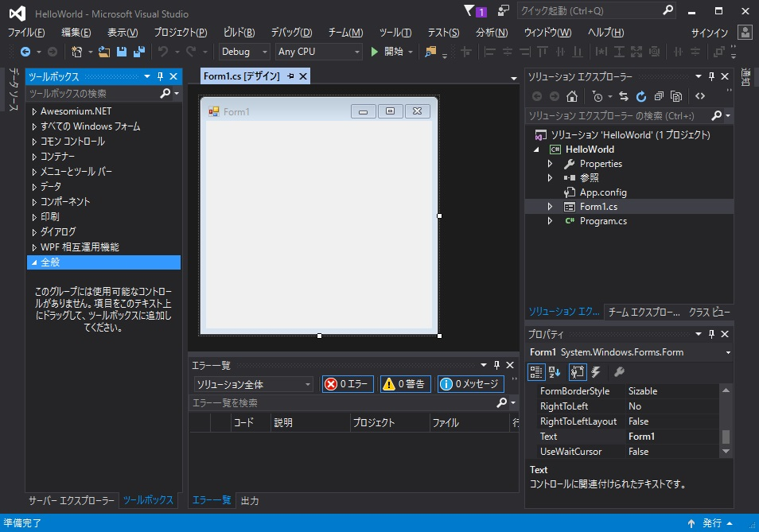
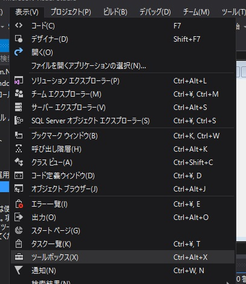

Hello World!
=====

[↑目次](..\README.md "目次")

Windows Formsを用いたGUIプログラミングの世界にようこそ！まずは最も簡単な「Hello World!」を表示するアプリケーションを作成しながら、Windows Formsアプリケーションの作り方を学んでいきましょう。

## Windows Formsとは？

はじめに「Windows Forms」とは何かというと、いわゆる「普通のWindowsのGUIアプリケーション」を作るためのプラットフォームです。その特徴は次のようなものです。

- マウスによる画面デザイン  
  テキストボックスやボタンなどの「コントロール」と呼ばれる「部品」を、マウスでドラッグ＆ドロップすることで配置し、実際の見た目を確認しながら画面をデザインできます。
- イベント・ドリブン  
  「画面が読み込まれた」、「ボタンが押された」、「テキストボックスの入力値が変更された」などのアクションをイベントと呼び、イベントに対する処理を記述してアプリケーションを作成します。

Windows Formsは.NET Frameworkのリリース時からあるプラットフォームですので、少し古臭いことは否めません。現在ではWPF（Windows Presentation Foundation）、UWP（Universal Windows Application）といった新たなプラットフォームもあります。

それでも、Windows Formsは今でも多く使われていますし、とっつきやすいのでGUIプログラミングの入門にはうってつけです。

## 初めてのGUIアプリケーション作成

何はともあれ、まずは画面に「Hello World!」を表示するだけの、簡単なGUIアプリケーションを作成してみましょう。

### プロジェクト作成

メニューから「新規作成」→「プロジェクト」を選択するなどして、「新しいプロジェクト」ダイアログを表示します（図1-1）。

図1-1 プロジェクトの新規作成

「新しいプロジェクト」ダイアログが表示されたら、「Visual C#」→「Windows フォーム アプリケーション」を選択してプロジェクトを作成します（図1-2）。名前等は次のように設定します。

- 名前 : HelloWorld
- 場所 : 任意
- ソリューションのディレクトリを作成 : チェックオフ
- 対象フレームワーク : .NET Framework 4.6.1

図1-2 HelloWorldプロジェクトの作成

プロジェクトが作成されると、`Form1.cs`ファイルの「フォーム デザイナ」が表示されます（図1-3）。Windows Formsでは、このフォームに各種の「コントロール」を配置して、画面をデザインしていくことになります。

図1-3 「フォーム デザイナ」の表示

### コントロールの配置

それでは、さっそく「コントロール」を使って画面に"Hello World!"を表示してみましょう。

まず最初に、VSの左側にある「ツールボックス」タブをクリックして、「ツールボックス」ウィンドウを表示します（図1-4）。もし「ツールボックス」タブがないときは、「表示」メニュー→「ツールボックス」を選択してください（図1-5）。また、「ツールボックス」に表示されているとおり、`Ctrl+Alt+X`のショートカットキーでも表示することができます。

表示した「ツールボックス」ウィンドウは、右上の「ピン」マークをクリックして、常に表示するようにしておきましょう。

図1-4 「ツールボックス」の表示

図1-5 「表示」メニュー→「ツールボックス」

次に、「ツールボックス」ウィンドウから、対象の「コントロール」を「フォーム デザイナ」上のフォームにドラッグ＆ドロップして配置します。ここでは、テキストを表示するための「Label（ラベル）」コントロールを使用します。「コモン コントロール」タブ→「Label」をフォーム上にドラッグ＆ドロップしてください（図1-6）。

図1-6 「Label（ラベル）」コントロールの配置

すると、フォーム上に"label1"と書かれた枠のついた項目が追加されます。これが、今配置したLabelコントロールです。

配置したコントロールにはそれぞれ独立した項目名がつけられ、「プロパティ」ウィンドウの一番上のドロップダウンリストを見ると確認できます。既定では"コントロール名（小文字）+1からの連番"がつけられますので、今回は"label1"という項目名になっています（この名前はもちろん後から変更できます。）。

そして、項目に表示するテキストは、「プロパティ」ウィンドウの`Text`プロパティが該当します。既定では項目名と同じ内容が設定されます。

図1-7 配置されたLabelコントロール

