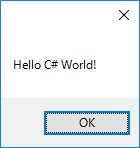
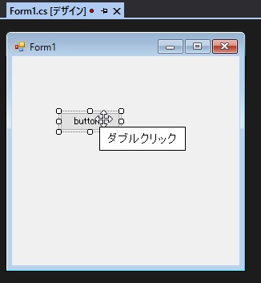

第２章 ボタンを押すと……？
=====

[↑目次](..\README.md "目次")

[←Hello World!](01-hello-world.md)

第1章では、ラベルのみの画面の作成を通じて、Windows Formsアプリケーションが起動して画面が表示される仕組みを理解しました。今度はユーザーの操作をどのように扱うのか学んでいきましょう。


## アプリ作成

この章で作成するのは、ボタンが一つだけある簡単なアプリです（図2-1）。ボタンをクリックすると、"Hello C# World!"と書かれたメッセージボックスが表示されます（図2-2）。


図2-1 アプリ起動



図2-2 メッセージボックス表示


### ボタンの配置

それでは、早速新たなアプリを作成していきましょう。まず、第1章で学んだ手順で、新たなWindows Formアプリケーションプロジェクト「ClickButton」を作成してください（図2-3）。


図2-3 ClickButtonプロジェクトの新規作成

次に第1章と同じ要領で、「ツールボックス」ウィンドウから「Button（ボタン）」コントロールを選び、フォームに配置します（図2-4）。このとき、コントロールの配置はドラッグ＆ドロップだけでなく、「ツールボックス」ウィンドウから選択した後、フォームの配置したい個所をクリックすることでも行えます。


図2-4 Buttonコントロールの配置


## ボタンの処理を作成

今度はボタンを押したときに行う処理を作成していきます。まず、フォームに配置したボタンをダブルクリックしてください（図2-5）。



図2-5 ボタンの処理作成

すると、`Form1`クラスのコード画面が表示され、ボタンを押した際に行う処理を書くためのプレースホルダーが自動的に追加されます。ここに、画面に"Hello C# World!"とメッセージボックスを出すように処理を書いてみましょう（リスト2-1）。

リスト2-1 ボタン処理のプレースホルダー（`Form1.cs`より）

```csharp
private void button1_Click(object sender, EventArgs e)
{
    MessageBox.Show("Hello C# World!");
}
```


### 動作確認

それでは、実際に動かして動作を確認してみましょう。第1章で説明したように、`F5`キーを押して実行すると、先ほど作成したボタンが一つだけの画面が図2-1のように表示されます。ここでボタンをクリックすると、図2-2のようにメッセージボックスが表示されるはずです。
