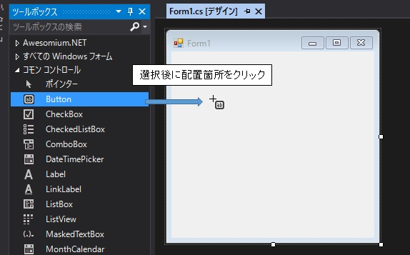

第2章 ボタンを押すと……？
=====

[↑目次](..\README.md "目次")

[←第1章 Hello World!](01-hello-world.md)

第1章では、ラベルのみの画面の作成を通じて、Windows Formsアプリケーションが起動して画面が表示される仕組みを理解しました。今度はユーザーの操作をどのように扱うのか学んでいきましょう。


## アプリ作成

この章で作成するのは、ボタンが一つだけある簡単なアプリです（図2-1）。ボタンをクリックすると、"Hello C# World!"と書かれたメッセージボックスが表示されます（図2-2）。


図2-1 アプリ起動


図2-2 メッセージボックス表示


### ボタンの配置

それでは、早速新たなアプリを作成していきましょう。まず、第1章で学んだ手順で、新たなWindows Formアプリケーションプロジェクト「ClickButton」を作成してください（図2-3）。


図2-3 ClickButtonプロジェクトの新規作成

次に第1章と同じ要領で、「ツールボックス」ウィンドウから「Button（ボタン）」コントロールを選び、フォームに配置します（図2-4）。このとき、コントロールの配置はドラッグ＆ドロップだけでなく、「ツールボックス」ウィンドウから選択した後、フォームの配置したい個所をクリックすることでも行えます。



図2-4 Buttonコントロールの配置


### ボタンの処理を作成

今度はボタンを押したときに行う処理を作成していきます。まず、フォームに配置したボタンをダブルクリックしてください（図2-5）。


図2-5 ボタンの処理作成

すると、`Form1`クラスのコード画面が表示され、ボタンを押した際に行う処理を書くためのプレースホルダーが自動的に追加されます。ここに、画面に"Hello C# World!"とメッセージボックスを出すように処理を書いてみましょう（リスト2-1）。

リスト2-1 ボタン処理のプレースホルダー（`Form1.cs`より）

```csharp
private void button1_Click(object sender, EventArgs e)
{
    MessageBox.Show("Hello C# World!");
}
```


### 動作確認

それでは、実際に動かして動作を確認してみましょう。第1章で説明したように、`F5`キーを押して実行すると、先ほど作成したボタンが一つだけの画面が図2-1のように表示されます。ここでボタンをクリックすると、図2-2のようにメッセージボックスが表示されるはずです。


## 動作の仕組み

さて、今度は実際にどのような仕組みで動作しているのか、順番に見ていきましょう。

### イベントとイベントハンドラー

「フォーム デザイナー」でButtonコントロールをダブルクリックした際、自動で追加されたコードは実はリスト2-1のプレースホルダーだけではありません。`Form1.Designer.cs`ファイルの`InitializeComponent`メソッドを見ると、次の1行が追加されています（リスト2-2）。

リスト2-2 自動生成されたコード（`Form1.Designer.cs`より）

```csharp
private void InitializeComponent()
{
    ... 略 ...

    this.button1.Click += new System.EventHandler(this.button1_Click);
    
    ... 略 ...
}
```

このコードはButtonコントロールの「`Click`イベント」に、リスト2-1のメソッドを「イベントハンドラー」として追加しています。つまり、「ボタンを押す（クリックする）」という挙動を「イベント」として表現し、その処理は「イベントハンドラー」で行うという、いわゆる「オブザーバー パターン」になっているのです（図2-6）。


図2-6 ボタンクリック処理イメージ

したがって、デザイナーに頼らずに独自の処理をイベントハンドラーに追加しても、ちゃんと処理されます。試しに、`Form1`クラスのコンストラクターで、ウィンドウタイトルを変更する処理をイベントハンドラーとして追加してみましょう（リスト2-3）。実行してボタンをクリックすると、`button1_Click`メソッドに記載したメッセージボックス表示処理とともに、今回追加した処理も行われることが確認できます（図2-7）。

リスト2-3 独自イベントハンドラー追加（`Form1.cs`より）

```csharp
public Form1()
{
    InitializeComponent();

    // ボタンをクリックしたら、ウィンドウタイトルを変える
    button1.Click += (sender, e) => this.Text = "Clicked!";
}
```


図2-7 独自イベントハンドラーの処理結果

### Windows Formsアプリケーション作成の進め方

Windows Formsには、今回のButtonコントロールのClickイベントのように、様々なコントロールにそれぞれ挙動に対応したイベントが用意されています。そんな各種コントロールのイベントに対する処理を組みわせていくことで、簡単なものから複雑なものまで、多種多様なアプリケーションを作成していくのです。

このような、「イベント」に対する処理を起点に作成する手法のことを、「イベント駆動」型と呼ぶこともあります。
Windows Formsは「イベント駆動」に特化したプラットフォームであるということを覚えておいてください。

## 参考：他のイベント駆動型プラットフォーム

なお、このようなイベント駆動型のプラットフォームは他にも色々あります。例えば、.NET Frameworkを用いたWebアプリケーションを作成するための「ASP.NET Web Forms」や、HTMLとJavaScriptの組み合わせで用いられるライブラリ「jQuery」なども、イベントを起点として処理を記載するやり方を取ります。


さて、次の章では、この「イベント」を活用し、ユーザーの入力を用いて処理を行うアプリケーションの作成方法を学んでいきましょう。

[→第3章 あなたのお名前は？](03-whats-your-name.md)
