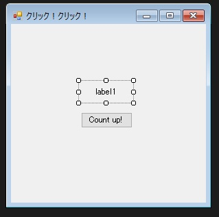
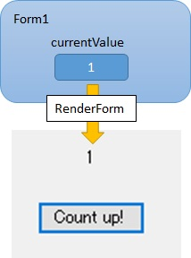
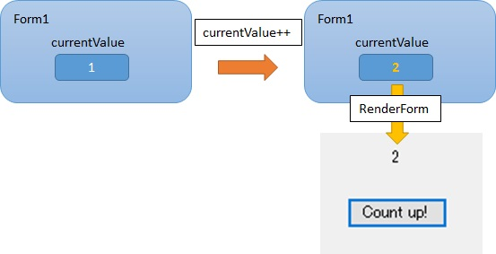
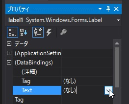
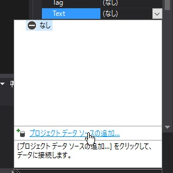
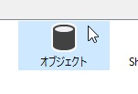
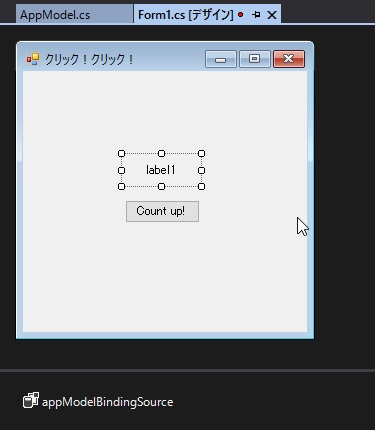
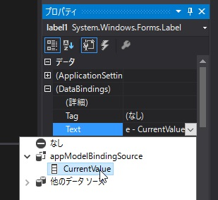
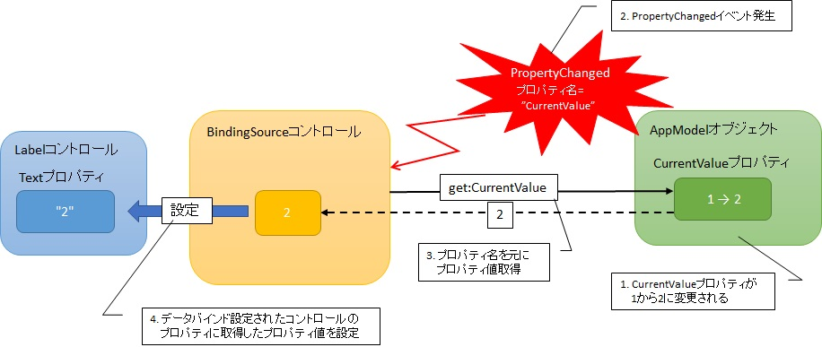
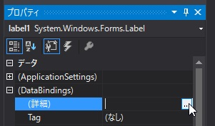

第5章 クリック！クリック！
=====

[↑目次](..\README.md "目次")

[←第4章 様々なコントロールたち](04-various-controls.md)

これまでの章で各種コントロールを使った簡単なアプリケーションは作れるようになりました。この章では、そのコントロールで管理するデータ、状態をどのように管理すればよいのか学んでいきましょう。


## アプリ概要

この章で作成するのは、ボタンが一つとラベルが一つある簡単なアプリです（図5-1）。ボタンをクリックすると、ラベルに表示された数字が1からカウントアップしていきます。


図5-1 カウントアップアプリ

## コントロールのみの場合

まずは、コントロールのみでこのアプリを作ってみましょう。新しいWindows Forms アプリケーションプロジェクト「CountUp」を作成し、ラベルとボタンを配置して位置やTextプロパティを設定しましょう（図5-2）。



図5-2 コントロールの配置

次に初期値を表示するため、Form.Loadイベントハンドラーを作成します（リスト5-1）。初期値は1なので、文字列で`"1"`をラベルのTextプロパティに設定します。

リスト5-1 初期値表示（`Form1.cs`より）

```csharp
private void Form1_Load(object sender, EventArgs e)
{
    label1.Text = "1";
}
```

今度はカウントアップを行うため、Button.Clickイベントハンドラーを作成します（リスト5-2）。まずラベルの表示テキストを整数型に変換して現在値を取得します。次に現在値をカウントアップし、ラベルに設定しなおします。

リスト5-2 カウントアップ処理（`Form1.cs`より）

```csharp
private void button1_Click(object sender, EventArgs e)
{
    var currentValue = int.Parse(label1.Text);

    currentValue++;

    label1.Text = currentValue.ToString();
}
```

以上で完成です。実行して動かしてみると、ボタンを押すたびに数値がカウントアップされることが確認できます。

## コントロールのみの問題点

コントロールのみでアプリを構成しても、この程度の規模なら何も問題ないように思うかもしれません。ですが、アプリケーションには「仕様変更」が付き物です。ここで仮に、数値を`"現在値:n"`のように表示したいという要望が出たとしたらどうでしょうか？実際にコードを変更してみましょう（リスト5-3）。

リスト5-3 コントロールのみで仕様変更対応（`Form1.cs`より）

```csharp
private void Form1_Load(object sender, EventArgs e)
{
    // 変更前 | label1.Text = "1";
    label1.Text = "現在値:1";
}

private void button1_Click(object sender, EventArgs e)
{
    // 変更前 | var currentValue = int.Parse(label1.Text);
    var currentValue = int.Parse(label1.Text.Replace("現在値:", ""));

    currentValue++;

    // 変更前 | label1.Text = currentValue.ToString("");
    label1.Text = currentValue.ToString("現在値:0");
}
```

こんな小さな見た目の変更だけなのに、なんと3か所も変更しなくてはならなくなりました。まず、初期値表示の箇所で`"現在値:"`を先頭に追加します。次に、現在値取得の箇所で`"現在値:"`を取り除いて整数に変換します。最後に、現在値表示する際、`"現在値:0"`のように書式指定文字列を追加します。

また、変更箇所が多いだけではありません。`"現在値:"`という文字列があちらこちらに点在してしまっていることも問題です。この文字列を定数にして使いまわすということで、ある程度影響を抑えることはできますが、それでも文字列操作を行わなければいけないことに変わりはありません。

こんなことを、表示の仕方を変えるたびに毎回変えていては非常に手間です。また、変更箇所が多いということは、それだけ誤り、漏れの可能性が高まるということでもあります。数値をカウントアップするだけという非常に簡単なアプリでもこの調子ですから、本格的なアプリケーションではどうなるか、容易に想像がつくと思います。


## フィールドの導入

それでは、この問題が起きないようにするにはどうすればよいのでしょうか？その答えは「フィールドを導入する」です。実際にフィールドで現在値を管理するようにしてみましょう（リスト5-4）。

リスト5-4 初期値表示（`Form1.cs`より）

```csharp
/// <summary>
/// 現在値。
/// </summary>
private int currentValue = 1;

/// <summary>
/// フォームを描画します。
/// </summary>
private void RenderForm()
{
    label1.Text = currentValue.ToString();
}

private void Form1_Load(object sender, EventArgs e)
{
    RenderForm();
}

private void button1_Click(object sender, EventArgs e)
{
    currentValue++;

    RenderForm();
}
```

この考え方では、「現在値」をアプリケーションの「状態」と捉え、状態をフィールドで保管し、アプリケーションではこの「状態」を仕様に合わせて加工して表示します。

まず、現在値のフィールド`currentValue`を宣言し、1で初期化します。そして、起動時の初期処理として、Form.LoadイベントハンドラーでRenderForm（レンダーフォーム）メソッドを呼び出しています。RenderFormメソッドはその名のとおり、画面の描画処理を担当していて、本アプリでは現在値を表示する処理を行います（図5-3）。



図5-3 初期処理

ボタンをクリックしたときは、`currentValue`フィールドをカウントアップして、RenderFormメソッドを呼び出しています（図5-4）。



図5-4 カウントアップ処理

このような作りにしておけば、仮に現在値を`"現在値:n"`のように表示するよう仕様変更があっても、変更するのはRenderFormメソッドの1行だけで影響を抑えることができます（リスト5-5）。

リスト5-5 フィールドを導入した場合の仕様変更対応（`Form1.cs`より）

```csharp
/// <summary>
/// フォームを描画します。
/// </summary>
private void RenderForm()
{
    // 変更前 | label1.Text = currentValue.ToString();
    label1.Text = currentValue.ToString("現在値:0");
}
```


このように、「状態」を`currentValue`フィールド、状態への操作をbutton1_Clickイベントハンドラー、状態の表示をRenderFormメソッドと分けることで、それぞれが行うべき「責務」を一つにして、プログラムのシンプルさと保守性を確保します。このような考えは「**Single Responsibility Principle（SRP、単一責務の原則）**」と呼ばれ、プログラミングに限らず設計・開発において最も重要な考えの一つです。

そして、その考えを「画面の表示」と「それ以外」について適用したのが、「**Presentation Domain Separation（PDS、プレゼンテーションとドメインの分離）**」と呼ばれる、プログラミングにおける設計原則です。これは、「見た目（プレゼンテーション）」という変更されやすい「もの」と、アプリケーションが持つ「処理、状態（ドメイン）」という「もの」を分離することで、「見た目」の変更からシステム全体を守ることを目的とした原則です。

この原則を意識してプログラミングすることで、既に見たように「現在値」とその操作というアプリケーションの根本的な部分を、表示の仕方という「見た目」の変更から守ることができます。

なお、本章のサンプルアプリでは「現在値」という単一の「状態」しか扱わなかったので、フィールドとして扱いましたが、実際のアプリでは扱う状態は多岐にわたります。ですので、そんなときは各状態を収める「クラス」を用意し、そのオブジェクトをフィールドに持つようにするとよいでしょう。

## データバインド

ここまでは現在値の表示を専用メソッドで行っていました。さらに進めて、フィールドの変更を即座に画面に同期させる方法もあります。この方法は「データバインド」と呼ばれ、見た目の操作コードを自分で書かなくてよくなるため、よりPDSを厳密に考慮したプログラムを作成できます。

ただし、便利になる反面準備のためのコード量が増えるという傾向もあります。したがって、ある程度大きな規模でないと、そのメリットを享受することはできません。作成するアプリの規模により、採用／不採用を検討してください。

### データバインド用オブジェクト型定義

ここではあくまでサンプルとして、カウントアップアプリでデータバインドを導入してみましょう。まず最初に、データバインドするオブジェクトの型を定義します（リスト5-6）。

リスト5-6 データバインドするオブジェクト型（`Form1.cs`より）

```csharp
using System.ComponentModel;

namespace CountUp
{
    public class AppModel : INotifyPropertyChanged
    {
        public event PropertyChangedEventHandler PropertyChanged;

        private int currentValue;

        /// <summary>
        /// 現在値。
        /// </summary>
        public int CurrentValue {
            get
            {
                return currentValue;
            }
            set
            {
                if (currentValue != value)
                {
                    currentValue = value;

                    PropertyChanged?.Invoke(
                        this,
                        new PropertyChangedEventArgs(nameof(CurrentValue))
                        );
                }
            }
        }

        /// <summary>
        /// AppModelクラスの新しいインスタンスを初期化します。
        /// </summary>
        /// <param name="initialValue">初期値。</param>
        public AppModel(int initialValue)
        {
            CurrentValue = initialValue;
        }
    }
}
```

ここでのポイントは「INotifyPropertyChanged（アイノーティファイプロパティーチェンジド）インターフェース」です。このインターフェースは「PropertyChanged（プロパティーチェンジド）イベントのみを持つインターフェースで、プロパティが変更されたらその名前を指定してイベントを発生させます。ここでは、CurrentValueプロパティーを作成し、そのsetブロックにてPropertyChangedイベント発生コードを記述しています。このときC# 6.0で新たに追加されたnameof演算子を用いると、プロパティ名の変更に強いコードが書けます。

こうしてデータバインド用オブジェクト型を定義したら一度プロジェクトをビルドしておきます。そうすることで、このオブジェクト使ったデータバインドを、デザイナーから行えるようになります。

### データバインド設定

次にフォームデザイナーでデータバインド設定を行います。まず、データバインド先であるLabelコントロールを選択し、プロパティ ウィンドウにて「(DataBindings)」→「Text」に表示される「▼」ボタンをクリックします（図5-5）。



図5-5 データバインドの設定

そして、「プロジェクト データ ソースの追加」リンクをクリックして「データ ソース構成ウィザード」を表示します（図5-6）。

 

図5-6 データ ソース構成ウィザード表示

そして、「オブジェクト」を選択して「次へ」ボタンをクリックし、「データ オブジェクトの選択」を表示します。「どのオブジェクトにバインドしますか？から先ほど追加したAppModelクラスを選択し、「完了」ボタンをクリックします（図5-7）。

 

図5-7 データ オブジェクトの選択

すると、フォームデザイナに`appModelBindingSource`という名前のBindingSourceコントロールが追加されます（図5-8）。



図5-8 appModelBindingSource追加

最後にプロパティ ウィンドウの「(DataBindings)」→「Text」プロパティにて、appModelBindingSource.CurrentValueプロパティを選択したら、データバインド設定の完了です（図5-9）。



図5-9 CurretValueプロパティをデータバインド

### データソースオブジェクト操作

今度はデータバインド元である「データソース」オブジェクトを操作します。といっても難しい話ではなく、AppModel型オブジェクトをフィールドとして追加し、先ほど追加されたappModelBindingSourceコントロールのDataSourceオブジェクトに設定するだけです（リスト5-7）。こうしてやれば、あとはAppModel型フィールドのプロパティを変更すれば、画面の表示も勝手に書き換わります。

リスト5-7 データソースオブジェクト操作（`Form1.cs`より）

```csharp
private AppModel model = new AppModel(initialValue: 1);

private void Form1_Load(object sender, EventArgs e)
{
    appModelBindingSource.DataSource = model;
}

private void button1_Click(object sender, EventArgs e)
{
    model.CurrentValue++;
}
```

### データバインドの仕組み

一見するとわかりにくいデータバインドですが、簡単に説明すると次のような仕組みで動いています（図5-10）。



図5-10 データバインドの仕組み

1. データソースオブジェクトのプロパティが変更される
2. PropertyChangedイベントが発生し、BindingSourceコントロールに通知される
3. PropertyChangedイベント引数のプロパティ名を使い、BindingSourceがデータソースからプロパティ値を取得する
4. データバインド設定されたコントロールのプロパティに、3.で取得したプロパティ値が設定される

この「コントロールとデータソースオブジェクトの間を、BindingSourceコントロールが仲介する」という仕組みはデータバインド対象コントロールが増えても、データソースのプロパティが増えても変わりません。したがって、対象項目が増えると最初の設定の手間は増えますが、以後の変更コストはほぼ一定に保つことができます。これもデータバインドを利用するメリットの一つです。

### 仕様変更対応

データバインドを使用している際、仮にこれまでと同じように、現在値を`"現在値:n"`のように表示するよう変更があったとしましょう。そんなときは、デザイナーから対応が可能です。つまり、目に見えるコードの範囲では一切変更がいらず、「見た目」の変更は見た目を編集することに特化した「デザイナー」だけに任せることができます。これもデータバインドのメリットの一つです。

デザイナーから現在値の表示書式を変更するには、まずプロパティ ウィンドウの「(DataBindings)」→「詳細」を選択して「...」ボタンをクリックし、「フォーマットと詳細バインド」ダイアログを表示します（図5-11）。

 

図5-11 「フォーマットと詳細バインド」ダイアログ

そして、「プロパティ」でTextプロパティを選択後、「形式」→「形式の種類」を「カスタム」に変更後、「カスタム書式」欄に`"現在値:0"`を入力して「OK」ボタンをクリックします（図5-12）
。


図5-12 カスタム書式設定

本章ではアプリのデータ、状態をどのように管理し、表示するかを学んできました。次の章では、そのデータの「妥当性」をどのように担保していくかについて学びます。

[→ 第6章 それはできません](06-cannot-do-it.md)
