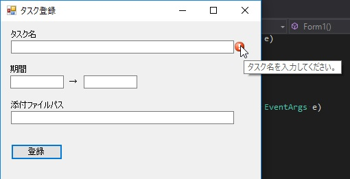
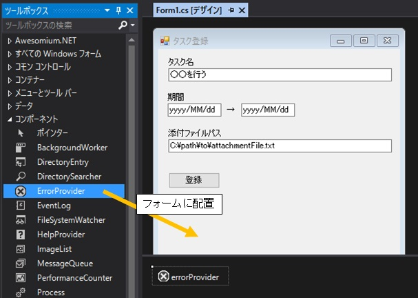

第6章 それはできません
=====

[↑目次](..\README.md "目次")

[←第5章 クリック！クリック！](05-click-click.md)

これまでの章で、アプリのデータを適切に管理し、画面に各種コントロールを使って表示できるようになりました。こんどはそのデータを画面から入力させるとき、妥当性を確保するための方法について学んでいきます。

## アプリ概要

この章で作成するのは簡単なタスク登録フォームです（図6-1）。「登録」ボタンをクリックすると、画面の各項目についてエラーチェックを行い、問題があればその内容を表示します。問題がなければ、「登録しました。」というメッセージボックスを表示します。

 

図6-1 タスク登録フォーム


## エラーの分類

実装に移る前に、エラーの分類について説明しておきます。

アプリケーションで起きるエラーは、大別すると次の2つにわけることができます。

- 業務エラー  
  アプリケーションの仕様として想定しているエラーであり、ユーザーは入力内容を変更して再度処理を実行することができます。
- システムエラー  
  アプリケーションが想定していないエラーであり、ユーザーは処理を続けることができないため、システム管理者にサポートを依頼する必要があります。

それぞれ順番に詳しく見ていきましょう。


## 業務エラー

前述のとおりアプリケーションとして想定内のことが起きたときに発生するエラーです。例えば、ユーザーの入力した内容が間違っていたり、値としては正しくてもシステムで扱えない場合などが該当します。

業務エラーが起きたら、ユーザーにその旨を通知して処理を中断します。ユーザーは通知された内容をもとに、入力内容を見直して再度処理を実行することもできますし、そこでやめることもできます。

つまり、エラーへの対応をユーザーに委ねることができるのが、業務エラーともいえます。

### 業務エラーの種類

業務エラーはそのチェック対象範囲によって、さらに次の種類に分けられます。

- 項目エラー
    - 項目単体エラー
    - 項目組合せエラー
- 突き合わせエラー

#### 項目エラー

「項目エラー」はユーザーが入力した内容だけでエラーかどうかの判断が可能なもので、さらにそれぞれの項目だけで判断する「項目単体エラー」、複数項目の関係で判断する「項目組合せチェック」に分けられます。

##### 項目単体エラーの例

- 名前が入力されていない
- 数量に数字以外が入力されている
- 商品コードの桁数が規定の長さでない

##### 項目組合せエラーの例

- 電話番号とメールアドレスのどちらも入力されていない
- 終了日に開始日より前の日付が入力されている
- メール送付チェックボックスにチェックが入っているが、メールアドレスが入力されていない

#### 突き合わせエラー

「項目エラー」とは違い、ユーザーの入力内容を元に外部の情報と「突き合わせ」て判断が必要なものは、「突き合わせエラー」と呼ばれます。ここで「外部」と呼んでいるのは「アプリケーションの外部」のことで、例えばOSの機能を使うもの（ファイルアクセスなど）も外部に含まれます。

##### 突き合わせエラーの例

- 入力された名前のファイルが存在しない
- 入力された郵便番号を外部Webサービスに問い合わせたら存在しない番号だった
- 入力した商品コードが既に使われていた


### 業務エラーの通知方法

業務エラーをユーザーに通知する方法にはいくつかあり、エラーの種類で使い分けることもよくあります。ここで、いくつか一般的な方法について紹介します。

#### メッセージボックス

メッセージを表示するという目的で一番手軽なのが、メッセージボックスを使う方法です。これまでの章でも何度か登場していますが、MessageBox.Showメソッドを呼び出すことで、メッセージボックスでメッセージを表示できます。

MessageBox.Showメソッドにはいくつもオーバーロードがあり、メッセージボックスのタイトルやアイコン、ボタンの数などを指定できます（リスト6-1、図6-2）。

リスト6-1 メッセージボックスでエラー表示（`Form1.cs`より）

```csharp
private void ShowErrorMessage(string message)
{
    MessageBox.Show(message, this.Text, MessageBoxButtons.OK, MessageBoxIcon.Error);
}
```


図6-2 メッセージボックスでエラー表示

メッセージボックスの特徴としては、ユーザーによる操作を行わないとメッセージを閉じることができないことがあります。そのため、複数の項目のエラーを順番に表示する、といった用途には向きません。

そこで、項目組合せエラーや突き合わせエラーの表示にメッセージボックスを用いることで、項目単体エラー時は他の手段で通知するとよいでしょう。

#### ErrorProvider（エラープロバイダー）コンポーネント

画面のコントロールに対してエラーメッセージを設定、表示するのが、ErrorProvider（エラープロバイダー）コンポーネントです。ErrorProviderコンポーネントのSetErrorメソッドに、エラーを設定するコントロールとエラーメッセージを引数で指定して呼び出すことで、画面のコントロールにエラーを設定できます（リスト6-2）。設定したエラーをクリアするには、SetErrorメソッドのエラーメッセージ引数に空文字を設定します。

リスト6-2 ErrorProviderコンポーネントでエラー表示（`Form1.cs`より）

```csharp
errorProvider.SetError(taskNameTextBox, "タスク名を入力してください。");
```

エラーが設定されたコントロールは、脇に「!」マークの入った赤丸アイコンが表示され、このアイコンにマウスカーソルをあてることでツールチップでエラーメッセージを確認できます（図6-3）。



図6-3 ErrorProviderコンポーネントでエラー表示

ErrorProviderコンポーネントは、ツールボックスの「コンポーネント」→「ErrorProvider」をフォームに配置して使います（図6-4）。



図6-4 ErrorProviderコンポーネントの配置

### 業務エラーの判定手順

前述のとおり、業務エラーにはいくつが種類があります。これらのエラーチェックをばらばらに行うと、どこでどのようなエラーが発生したかわかりにくくなりますし、エラー判定条件の変更への対応が難しくなってしまいます。

こういった問題を避けるため、業務エラーの判定は次のような順で行うとよいでしょう。

1. 項目チェック
    1. 項目単体チェック
    2. 項目組合せチェック
2. 突き合わせチェック

ここでもう一つのポイントとして、「項目チェック」を終えた段階でエラーがあれば、そこで中断することを勧めます。つまり、ユーザーの入力内容のみで問題がないときだけ、外部に依存する突き合わせチェックを行うのです。

こうすることで、余計な外部アクセスを抑制してパフォーマンス上にも有利になりますし、判定処理の役割も分かれて見通しがよくなります（リスト6-3）。

リスト6-3 エラー判定処理（`Form1.cs`より）

```csharp
private bool ValidateForm()
{
    CrearErrors();

    // ■項目エラーチェック

    // □項目単体チェック
    var hasItemError = false;

    // タスク名
    if (string.IsNullOrEmpty(taskNameTextBox.Text))
    {
        errorProvider.SetError(taskNameTextBox, "タスク名を入力してください。");
        hasItemError = true;
    }

    // 期間開始日
    DateTime? dueFrom;
    var dueFromIsValid = TryParseDate(dueFromTextBox.Text, out dueFrom);
    if (dueFromIsValid == false)
    {
        errorProvider.SetError(dueFromTextBox, "期間開始日に日付を入力してください。");
        hasItemError = true;
    }

    // 期間終了日
    DateTime? dueTo;
    var dueToIsValid = TryParseDate(dueToTextBox.Text, out dueTo);
    if (dueToIsValid == false)
    {
        errorProvider.SetError(dueToTextBox, "期間終了日に日付を入力してください。");
        hasItemError = true;
    }

    // □項目組合せチェック
    // 期間
    if (dueFrom.HasValue && dueTo.HasValue)
    {
        // 開始、終了日とも入力あり
        if (dueTo.Value < dueFrom.Value)
        {
            // 終了日が開始日より前
            ShowErrorMessage("期間終了日には開始日以降の日付を入力してください。");
            hasItemError = true;
        }
    }
    else
    {
        if (dueFromIsValid && dueToIsValid &&
            (dueFrom.HasValue || dueTo.HasValue))
        {
            // 開始、終了日の一方のみ入力あり
            ShowErrorMessage("期間を入力する場合、開始日と終了日の両方を入力してください。");
            hasItemError = true;
        }
    }

    if (hasItemError)
    {
        // 項目チェックエラーあり
        return false;
    }

    // ■突き合わせチェック
    if (string.IsNullOrEmpty(attachmentFilePathTextBox.Text) == false &&
        File.Exists(attachmentFilePathTextBox.Text) == false)
    {
        // 開始、終了日の一方のみ入力あり
        ShowErrorMessage($@"添付ファイル{attachmentFilePathTextBox.Text}がありません。
存在するファイルパスを入力してください。");
        return false;
    }

    return true;
}
```

このようにエラー判定処理をメソッドにしておけば、登録等の処理の見通しもよくなります（リスト6-4）。

リスト6-4 登録処理（`Form1.cs`より）

```csharp
private void registerButton_Click(object sender, EventArgs e)
{
    // エラーチェック
    var isValid = ValidateForm();

    if (isValid == false)
    {
        // 業務エラーあり
        return;
    }

    // 登録処理実行
    ...（略）...

    MessageBox.Show("タスクを登録しました。");

    ClearForm();

    SetInitialFocus();
}
```


## システムエラー

前述のとおり、アプリケーションとして想定していない事態が起きたときに発生するのがシステムエラーです。例えば、ネットワークケーブルが抜けていた、アクセスしているWebサービスがダウンしていた、HDDの空き容量がなくなった、といったケースが該当します。

### 例外処理

こういった想定外の事象を扱うのにうってつけなのが、.NETの例外機構です。ただし、プログラミング言語のテキストに書いてあるtry-catch構文は原則として使いません。「例外」は**例外的**な事態だから例外であるのであって、そんな処理をプログラムのあちこちに埋め込んでしまっては、プログラムの見通しも悪くなりますし、「処理漏れ」の元にもなります。

### 集約例外ハンドラー

ではどうするかというと、各プラットフォームに用意された「集約例外ハンドラー」を用います。

集約例外ハンドラーはその名のとおり、アプリケーションで起きた例外を一手に引き受ける仕組みです。try-catch句で処理しなかった例外は、すべて集約例外ハンドラーで捉えて、ユーザーに通知後、後処理を行います。

Windows Formsアプリケーションでは、System.Windows.Forms.ApplicationクラスのThreadExceptionイベントで処理します（リスト6-5）。

リスト6-5 集約例外ハンドラー設定（`Program.cs`より）

```csharp
using System;
using System.Diagnostics;
using System.Windows.Forms;

namespace RegisterTask
{
    static class Program
    {
        /// <summary>
        /// アプリケーションのメイン エントリ ポイントです。
        /// </summary>
        [STAThread]
        static void Main()
        {
            Application.ThreadException += (sender, e) =>
            {
                MessageBox.Show(
                    "予期せぬエラーが発生しました。詳細はイベントログを確認して下さい。",
                    "BMI計算機",
                    MessageBoxButtons.OK,
                    MessageBoxIcon.Stop);

                EventLog.WriteEntry(
                    "Application",
                    e.Exception.ToString(),
                    System.Diagnostics.EventLogEntryType.Error
                    );

                Application.Exit();
            };

            Application.EnableVisualStyles();
            Application.SetCompatibleTextRenderingDefault(false);
            Application.Run(new Form1());
        }
    }
}
```

#### システムエラーの通知方法

システムエラーは「想定外」のケースが発生したのですから、ユーザーにそのことを通知して、システム管理者に処理を仰ぐよう促す必要があります。

ただ、そのときに注意することは、「ユーザーにはエラーの詳細を見せてはいけない」ということです。一般的なユーザーは、アプリケーションがどのような仕組みで動いているか知りませんし、また知っているべきではありません。例外にはアプリケーションの詳細な情報が含まれる場合があり、それには機密情報が含まれていないとも限りません。

したがって、エラーの詳細はログファイルなどに書き出して管理者だけが参照できるようにして、ユーザーには簡潔なメッセージを見せるだけでよいのです。

なお、メッセージを出す方法は通常のメッセージボックスの他、専用にカスタマイズしたシステムエラー通知フォームを使うこともよくあります。

#### システムエラーの後処理

ユーザーへの通知を終えたら、発生した例外を始め、トラブルシューティングに必要な情報を記録します。例えば、OSの種類とそのバージョン、使っているCPUやメモリ使用状況、HDDの空き容量、エラー発生時のスクリーンショットなど、ありとあらゆる情報がその候補になります。

記録先としてはログファイルの他、Windowsのイベントログ、SYSLOG等の外部ログ、また収集した情報をメールで管理者に送ったり、エラー情報取得用Webサービスに送信したりと、様々です。

こういった記録が終わった後、これ以上の処理継続は不可能なので、アプリケーションを強制的に終了します。それにはApplication.Exitメソッドなどが使えます。

### try-catchを行うケース

あくまで原則はtry-catch構文を使いませんが、使わないといけないケースもあります。例えば、ファイルの有無を事前にチェックすることはできますが、チェックと実際にファイルを開く処理のわずかな間に、対象ファイルが削除されるということも考えられます。

そんなときは、try-catch構文を使って、「特定の例外」だけを処理するようにします。ファイルの有無であれば、`System.IO.FileNotFoundException`だけをcatchブロックで処理し、その他の例外を集約例外ハンドラーに任せます。

また、もう一つ気を付けるポイントは、try-catch構文は対象とする例外が発生する処理だけを囲むよう、範囲を狭める必要があります。ファイルを開く場合なら、File.Openメソッドのみをtryブロックで囲むようにしましょう。

### 発生した例外に後処理が必要なケース

例外が起きた時その場で「後処理」が必要なケースもあります。例えば、ファイルを開いていれば閉じなければなりませんし、大量のメモリを使用していれば解放してやらなければいけません。こういった個別のケースは、集約例外ハンドラーでは対応できません。

そのため、こういったケース専用のtry-finally構文で後処理を行う必要があります。例えばtryブロックの内部で開いたファイルを、finalllyブロックで閉じるようにします。こうしておくことで、例外の発生有無に限らず、必ずファイルを閉じる処理が行われることを保証できます。

try-catch-finally構文を使ってファイル操作を扱うと、次のようになります（リスト6-6）。

リスト6-6 ファイル操作の例外処理（`Form1.cs`の登録ボタンクリックイベントハンドラーより）

```csharp
Stream stream = null;
try
{
    // 添付ファイルオープン
    stream = File.Open(attachmentFilePathTextBox.Text, FileMode.Open);
}
catch(FileNotFoundException)
{
    ShowErrorMessage($@"添付ファイル{attachmentFilePathTextBox.Text}がありません。
存在するファイルパスを入力してください。");
    return;
}
finally
{
    // 添付ファイルクローズ
    stream?.Close();
}
```

### using構文

後処理を必ず行う場合、try-finally構文を使うとよいと説明してきましたが、.NET Frameworkにはもう一つusing構文とIDisposableインターフェースがあります。これは、後処理を行うDisposeメソッド一つだけを持つIDisposableインターフェースを実装した型を対象に、using構文を使うことで自動的にDisposeメソッドを呼び出して後処理を行ってくれるというものです。

上記のファイル操作の例外処理を、using構文を使って書き直すと次のようになります（リスト6-7）。

リスト6-7 using構文を使ったファイル操作

```csharp
try
{
    // 添付ファイルオープン
    using (var stream = File.Open(attachmentFilePathTextBox.Text, FileMode.Open))
    {
        // 登録処理
    }
}
catch (FileNotFoundException)
{
    ShowErrorMessage($@"添付ファイル{attachmentFilePathTextBox.Text}がありません。
存在するファイルパスを入力してください。");
    return;
}
```

IDisposableインターフェースを実装した型は.NET Frameworkに大量に存在します。新たな型を見かけたら、F12キーを押して定義を確認し、IDisposableインターフェースを実装しているようなら必ずusing構文を使うようにしてください。このことが、バグの発生を抑えますし、メモリの消費量を抑えることにもつながります。

ここまでで、単一画面のアプリケーションであれば、正常処理、異常処理含めて実装することができるようになりました。次の章からは、複数画面を組み合わせる場合について学んでいきましょう。


