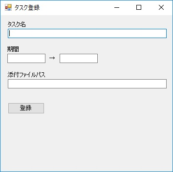
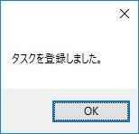

第6章 それはできません
=====

[↑目次](..\README.md "目次")

[←第5章 クリック！クリック！](05-click-click.md)

これまでの章で、アプリのデータを適切に管理し、画面に各種コントロールを使って表示できるようになりました。こんどはそのデータを画面から入力させるとき、妥当性を確保するための方法について学んでいきます。

## アプリ概要

この章で作成するのは簡単なタスク登録フォームです（図6-1）。「登録」ボタンをクリックすると、画面の各項目についてエラーチェックを行い、問題があればその内容を表示します。問題がなければ、「登録しました。」というメッセージボックスを表示します。

 

図6-1 タスク登録フォーム

## エラーの分類

実装に移る前に、エラーの分類について説明しておきます。

アプリケーションで起きるエラーは、大別すると次の2つにわけることができます。

- 業務エラー  
  アプリケーションの仕様として想定しているエラーであり、ユーザーは入力内容を変更して再度処理を実行することができます。
- システムエラー  
  アプリケーションが想定していないエラーであり、ユーザーは処理を続けることができないため、システム管理者にサポートを依頼する必要があります。

それぞれ順番に詳しく見ていきましょう。

## 業務エラー

前述のとおりアプリケーションとして想定内のことが起きたときに発生するエラーです。例えば、ユーザーの入力した内容が間違っていたり、値としては正しくてもシステムで扱えない場合などが該当します。

業務エラーが起きたら、ユーザーにその旨を通知して処理を中断します。ユーザーは通知された内容をもとに、入力内容を見直して再度処理を実行することもできますし、そこでやめることもできます。

つまり、エラーへの対応をユーザーに委ねることができるのが、業務エラーともいえます。

### 業務エラーの種類

業務エラーはそのチェック対象範囲によって、さらに次の種類に分けられます。

- 項目エラー
    - 項目単体エラー
    - 項目組合せエラー
- 突き合わせエラー

#### 項目エラー

「項目エラー」はユーザーが入力した内容だけでエラーかどうかの判断が可能なもので、さらにそれぞれの項目だけで判断する「項目単体エラー」、複数項目の関係で判断する「項目組合せチェック」に分けられます。

##### 項目単体エラーの例

- 名前が入力されていない
- 数量に数字以外が入力されている
- 商品コードの桁数が規定の長さでない

##### 項目組合せエラーの例

- 電話番号とメールアドレスのどちらも入力されていない
- 終了日に開始日より前の日付が入力されている
- メール送付チェックボックスにチェックが入っているが、メールアドレスが入力されていない

#### 突き合わせエラー

「項目エラー」とは違い、ユーザーの入力内容を元に外部の情報と「突き合わせ」て判断が必要なものは、「突き合わせエラー」と呼ばれます。ここで「外部」と呼んでいるのは「アプリケーションの外部」のことで、例えばOSの機能を使うもの（ファイルアクセスなど）も外部に含まれます。

##### 突き合わせエラーの例

- 入力された名前のファイルが存在しない
- 入力された郵便番号を外部Webサービスに問い合わせたら存在しない番号だった
- 入力した商品コードが既に使われていた

### 業務エラーの通知方法

- メッセージボックス
- ErrorProvider（エラープロバイダー）コンポーネント

## システムエラー

### 例外処理

システムエラーは「例外」で扱う
各画面で例外を処理せず、「集約例外ハンドラー」で一括して行う

### システムエラーの通知方法

- メッセージボックス
- 独自エラーダイアログ

### システムエラーの後処理

直ちにアプリケーションを終了する
