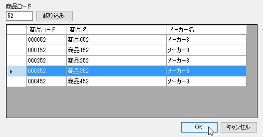

第7章 貴方にお任せ
=====

[↑目次](..\README.md "目次")

[←第6章 それはできません](06-cannot-do-it.md)

ここまでの章の内容を使えば、単一画面しかないアプリケーションであれば、十分なものができるようになります。ただ、実際のアプリケーションでは、複数の画面を使った処理ができないと困ったことになります。

そこで、本章と次の章では、複数画面を使った連携処理について学んできます。

## 子画面の呼び出し方

自らの画面（親画面）から他の画面（子画面）を呼び出して表示するには、次の2つの方法があります。

- モーダル表示  
  子画面を表示した際、親画面の操作をブロックして完全に子画面に処理を移譲する方法
- モードレス表示  
  子画面を表示しても親画面も引き続き操作可能にする方法

本章では「モーダル表示」のやり方について学んでいきます。

## アプリ概要

本章で扱うサンプルアプリは2つの画面で構成されています。

一つはメイン画面で、商品コードの入力と商品名の表示、そして商品検索子画面を呼び出すための「商品検索」ボタンがあります（図7-1）。


図7-1 メイン画面

「商品検索」ボタンをクリックすると、メイン画面の商品コードに入力した値を、検索条件として商品検索画面に受け渡してモーダル表示します。このとき、受け渡した商品コードは初期値として絞り込み条件の商品コード欄に表示され、その値を含む商品だけに絞り込んで、商品検索画面は表示されます（図7-2）。

 

図7-2 商品検索画面

商品検索画面では、絞り込み条件の商品コードを変更して、「絞り込み」ボタンをクリックすると、入力した値で再度商品の絞り込みを行えます。

そうして目的の商品があったら、グリッドで選択して「OK」ボタンをクリックすることで、商品の選択が行えます。「OK」ボタンをクリックすると、商品検索画面は閉じられ、親画面の商品コード、商品名に選択した商品の情報が表示されます（図7-3）。

 

図7-3 商品選択後

仮に商品検索画面で「キャンセル」ボタンがクリックされた場合、商品選択は行われず、メイン画面の表示も変更されません。

## モーダル表示

子画面をモーダル表示するには、対象となる画面のFormクラスのインスタンスを作成し、そのShowDialogメソッドを呼び出します（リスト7-1）。このとき、FormクラスはIDisposableインターフェースを実装しているので、using構文を使って必ずDisposeが呼ばれるようにしてください。

リスト7-1 モーダル表示（`MainForm.cs`の商品検索ボタンクリックハンドラーより）

```csharp
using (var searchProductDialog = new SearchProductDialog(productCode: productCodeTextBox.Text))
{
    ...（略）...
}
```

### 子画面への情報受け渡し

リスト7-1を見ると分かるのですが、親画面から子画面に情報を渡したいときは、子画面のコンストラクターで必要な情報を受け渡すのが一般的です。子画面側ではコンストラクターで必要な情報を受け取った後、Loadイベントハンドラーでその情報を使って処理を行います（リスト7-2）。サンプルでは親画面から受け取った商品コードを画面に設定し、絞り込み処理を実行しています。

リスト7-2 親画面からの情報受け取り（`SearchProductDialog.cs`より）

```csharp
public SearchProductDialog(string productCode) : this()
{
    ProductCode = productCode;
}

private void SearchProductForm_Load(object sender, EventArgs e)
{
    productCodeTextBox.Text = ProductCode;

    FilterProducts(productCodeTextBox.Text);
}
```

あくまでコンストラクターはインスタンスを作る役割に徹して、実際の処理はイベントハンドラーに任せることで、処理の複雑化を防ぐことができます。

### 子画面の処理結果の判定

子画面での処理結果を判定するには、子画面のフォームクラスのDialogResultプロパティを使います。このプロパティの型はSystem.Windows.Forms.DialogResult構造体で、OKやキャンセルといった処理結果を表します。

このDialogResultプロパティをモーダル表示された画面の結果を子画面側で設定すると、呼び出し元である親画面ではShowDialogメソッドの戻り値として参照することができます（リスト7-3）。これを利用して、OKの時だけ処理を行う、といったことが実現できます。

リスト7-3 DialogResult参照（`MainForm.cs`の商品検索ボタンクリックハンドラーより）

```csharp
var result = searchProductDialog.ShowDialog();
if (result == DialogResult.OK)
{
    ...（略）...
}
```

DialogResultプロパティの設定方法は、ボタンクリックイベントハンドラーなどでコードから直接設定する方法の他、ButtonコントロールのDialogResultプロパティにデザイナーから設定しておけば、そのButtonコントロールをクリックすると自動的にフォームのDialogResultプロパティに設定されます（図7-4）。


図7-4 ボタンへのDialogResult設定

## 子画面の情報の取得

子画面で処理を行った後必要な情報を得るには、子画面の読取専用プロパティを用います。

## 子画面から親画面は触らない

ついやりがちなのが、子画面から親画面の情報にアクセスするということですが、これは避けるべきです。

循環参照の関係となり、スパゲッティーコードを生み出すもとになる。

このためにはコンストラクターで渡すべき情報と子画面から読取専用プロパティで公開すべき情報をしっかり設計しなくてはならない。


