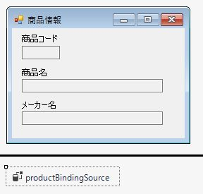

第8章 一緒にやろう
=====

[↑目次](..\README.md "目次")

[← 第7章 貴方にお任せ](07-leave-it-to-you.md)

前の章ではモーダル表示による複数画面連携の方法について学びました。本章では、モードレス表示による複数画面連携の手順について学んでいきましょう。

## アプリ概要

本章で扱うサンプルアプリは2つの画面で構成されています。

一つはメイン画面で、リストボックスに商品情報を表示してあり、商品名による絞り込みを行えます（図8-1）。


図8-1 メイン画面

もう一つは商品情報表示画面で、アプリケーション起動時にメイン画面と一緒に表示されます。この画面にはメイン画面のリストボックスで選択した商品の商品コード、商品名、メーカー名を表示します（図8-2）。また、メイン画面で商品を選択しなおすたびに、商品情報は再表示されます。


図8-2 商品情報表示画面

メイン画面を閉じると、商品情報画面も閉じてアプリケーションが終了します。


## モードレス表示

子画面をモードレス表示するには、対象となる画面のフォームクラスのインスタンスを作成し、そのShowメソッドを呼び出します。このとき、子画面のインスタンスをローカル変数として宣言すると、メソッド終了時に変数が破棄され、子画面がすぐに閉じてしまいます。したがって、子画面は親画面などのフィールドとして保持する必要があります（リスト8-1）。
w


リスト8-1 モードレス表示（`MainForm.cs`より）

```csharp
private ProductForm productForm;

private void MainForm_Load(object sender, EventArgs e)
{
    productForm = new ProductForm
    {
        StartPosition = FormStartPosition.Manual,
        Left = this.Left + this.Width + 20,
        Top = this.Top
    };

    FilterProducts(productNameTextBox.Text);
}

private void MainForm_Shown(object sender, EventArgs e)
{
    productForm.Show();
}
```

サンプルではアプリケーション起動時にメイン画面と一緒に商品情報表示画面を開くため、まず親画面のLoadイベントハンドラーで子画面のインスタンスを作成（および初期位置設定）してフィールドに格納します。次に、親画面表示時に発生するShown（ショウン）イベントハンドラーにて、子画面インスタンスのShowメソッドを呼び出して、子画面を表示しています。

子画面のインスタンスはフィールドとして保持しているため、親画面を閉じるときに一緒に閉じる必要があります。そのため、親画面を閉じるときに発生するFormClosing（フォームクロージング）イベントにて、子画面インスタンスのClose（クローズ）メソッドを呼び出し、子画面を閉じるようにします（リスト8-2）。

リスト8-2 子画面を閉じる（`MainForm.cs`より）

```csharp
private void MainForm_FormClosing(object sender, FormClosingEventArgs e)
{
    productForm?.Close();
}
```

なお、子画面インスタンスのHide（ハイド）メソッドを呼び出すことで、画面を閉じるのではなく「隠す」こともできます。画面の状態を残したまま、一時的に画面を見えなくするようなときには、こちらのメソッドを使いましょう。再度画面を表示するには、Showメソッドを呼び出せばよいです。ただしこのとき、Shownイベントが発生するので、画面を初めて表示したときに行いたい処理は、ShownイベントハンドラーではなくLoadイベントハンドラーに書くようにしましょう。


## 子画面への受け渡し

モードレス表示で子画面を表示しているときは、親画面側の操作を元に、子画面の操作を行うことがよくあります。例えば、サンプルではメイン画面リストボックスで選択した商品が変わったら、その情報を商品情報表示画面に反映しています。

こういった場合、子画面への情報受け渡しには、設定専用プロパティを用いるとよいでしょう（リスト8-3）。

リスト8-3 子画面への情報設定（`MainForm.cs`より）

```csharp
private void productBindingSource_CurrentChanged(object sender, EventArgs e)
{
    productForm.Product = productBindingSource.Current as Product;
}
```

子画面側では、プロパティに設定されたら、受け取った情報をもとに画面に反映します（リスト8-4）。

リスト8-4 子画面での設定情報利用（`ProductForm.cs`より）

```csharp
public Product Product
{
    set
    {
        productCodeTextBox.Text = value.Code;
        productNameTextBox.Text = value.Name;
        makerNameTextBox.Text = value.MakerName;
    }
}
```

なお、子画面側で入力した情報をもとに親画面を変更したい、といったケースもあるでしょう。こういったときでも、モーダル表示のところで説明した通り、子画面から親画面を操作してはいけません。

ではどうすればよいかというと、子画面側に独自のイベントを追加し、親画面側でそのイベントハンドラーを定義して処理すればよいのです。こうすることで、子画面は親画面のことは知らなくとも、子画面から親画面側に通知することができます。あとは、イベント引数や子画面の読取専用プロパティを通じて情報を取得し、親画面に反映させます。

具体的なコードについては省きますが、循環参照にならないようにするテクニックとして覚えておいてください。

## データバインドでの解決

データバインドを使って親子画面の選択データを同期することもできます。それには、親画面とBindingSourceコンポーネントを子画面と共有する必要があります。

まず、子画面に親画面と同じようにProduct型を扱うBindingSourceコンポーネントを追加してやります。これは親画面のフォームデザイナーでproductBindingSourceをコピーして、子画面のフォームデザイナーで貼り付ければ簡単です（図8-3）。



図8-3 子画面にBindingSourceコンポーネント追加

次に、BindingSource型の引数を受け取るコンストラクターを追加し、**コードで**データバインドを指定してやります。これはデザイナーでデータバインドを行っても、それは子画面側で自動で作られたBindingSource型インスタンスに対してのデータバインド設定になってしまい、意味がないためです（リスト8-5）。

リスト8-5 コンストラクターでBindingSourceインスタンスを受け取る（`ProductForm.cs`より）

```csharp
public ProductForm(BindingSource productBindingSource) : this()
{
    this.productBindingSource = productBindingSource;

    // データバインド設定
    // ※Bindingインスタンス作成時の引数は次の通り
    // 　1. コントロールのバインド対象プロパティ名
    //   2. バインドするデータソースオブジェクト
    //   3. データオブジェクトのバインド対象プロパティ名
    //   4. 書式指定有無（trueならあり）
    productCodeTextBox.DataBindings.Add(
        new Binding("Text", productBindingSource, nameof(Product.Code), false));
    productNameTextBox.DataBindings.Add(
        new Binding("Text", productBindingSource, nameof(Product.Name), false));
    makerNameTextBox.DataBindings.Add(
        new Binding("Text", productBindingSource, nameof(Product.MakerName), false));
}
```

あとは、親画面で子画面のインスタンスを作る際、引数に親画面のproductBindingSourceを渡してやればOKです（リスト8-6）。

リスト8-6 コンストラクターでBindingSourceインスタンスを渡す（`MainForm.cs`より）

```csharp
private void MainForm_Load(object sender, EventArgs e)
{
    productForm = new ProductForm(productBindingSource) // <-ここで渡す
    {
        StartPosition = FormStartPosition.Manual,
        Left = this.Left + this.Width + 20,
        Top = this.Top
    };

    FilterProducts(productNameTextBox.Text);
}
```

詳しくはサンプルのBrowseProduct-DataBindを参照してみてください。

## 最後に

8章に渡りWindows Formアプリケーションを使ったGUIアプリケーション作成の基本ついて学んできました。

これである程度思い通りにGUIアプリケーションを作れるようになっているはずです。後は各種コントロールの詳細を始め、不足している情報については適宜Web検索などで補填しつつ、試行錯誤を繰り返してスキルを高めていってください。

また、本文書の内容は他のプラットフォームでもある程度通じる内容も含んでいます。別のプラットフォームでも本書で学んだことをベースに、そのプラットフォームでのやり方を学び、応用していってください。
